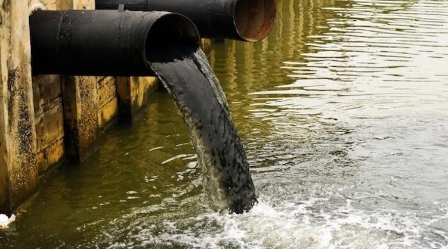
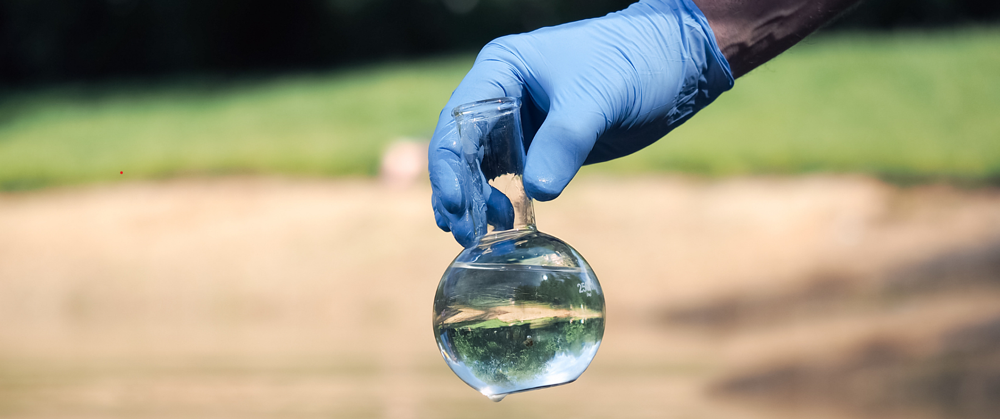
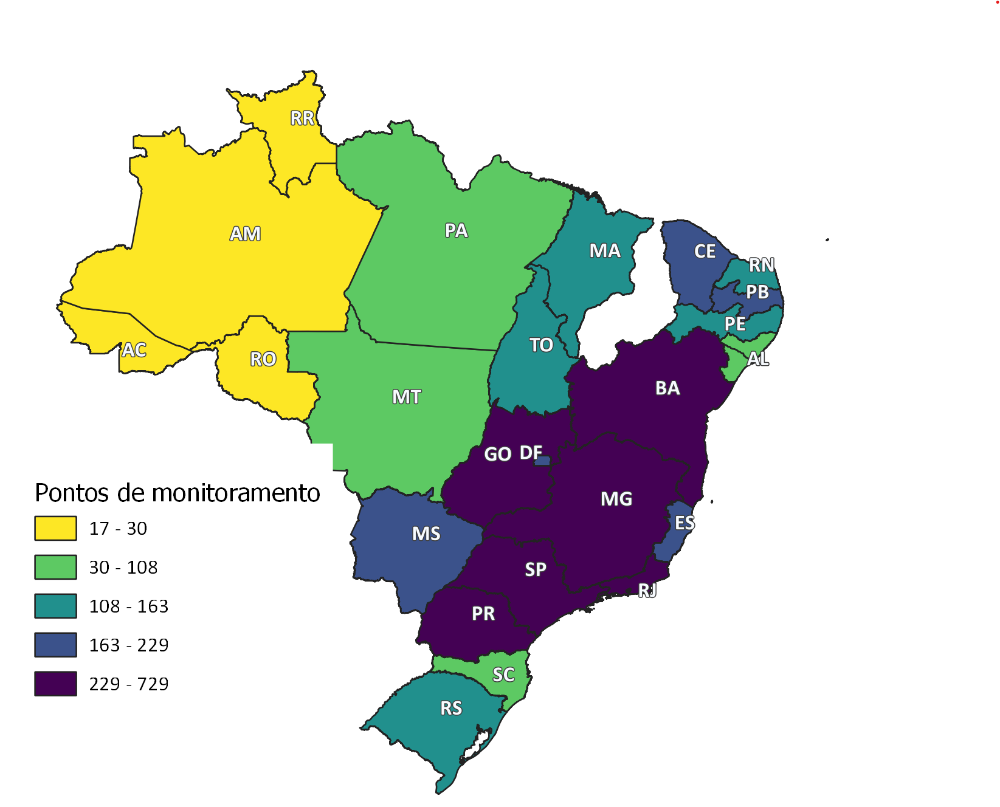

```{r setup, include=FALSE}
knitr::opts_chunk$set(echo = TRUE, collapse = TRUE, warning = FALSE, results='asis')

```


```{r packs, echo=FALSE, warning=FALSE, results='hide', message=FALSE}
library(dplyr)
library(tidyr)
library(RPostgreSQL)
library(ggplot2)
library(lubridate)
library(htmltools)
library(rsconnect)
library(shinyWidgets)
library(nortest)
library(DBI)
library(NADA)
library(readr)
library(tidyverse)
library(sf)
library(mapview)
library(Hmisc)
library(knitr)
library(kableExtra)
library(htmlwidgets)
library(sp)
library(lattice)
library(leafpop)
library(rgdal)
```


```{r, echo=FALSE}


drv<- dbDriver("PostgreSQL")
con <- dbConnect(drv, dbname = "qa_v01_14_local", 
                 host = "localhost", port = 5432,
                 user = "postgres", password ="postgres" )

parametro <- 'od'
parametro_abreviado <- "OD"
parametro_extenso <- "Oxigênio Dissolvido na água"

serie_ini <- as.Date('2010-01-01', format = "%Y-%m-%d")
serie_final <- as.Date('2023-12-31', format = "%Y-%m-%d")

# Extrai os anos das datas
ini <- substr(serie_ini, 1, 4)
final <- substr(serie_final, 1, 4)

```

   
### **A Qualidade da Água**

A qualidade da água nos corpos hídricos é determinada pelas condições naturais e ações humanas praticadas na bacia hidrográfica. Entre os fatores naturais que influenciam a qualidade da água em rios e lagos estão:    

- A dissolução de minerais presentes no solo e subsolo em função do intemperismo;   
- Processos atmosféricos de evapotranspiração e deposição de partículas carreadas pelo vento;    
- Decomposição da matéria orgânica e lixiviação natural de nutrientes;    
- Fatores hidrológicos ligados ao regime de escoamento; e processos biológicos que alteram a composição física e química da água. 
    
<div style='float:right; padding-left: 15px'>

```{r fig_poluicao, echo = FALSE}



```

</div>
     

Atualmente as ações humanas têm sido apontadas como a principal causa da degradação da qualidade da água que usamos para os mais diversos fins. Das volumosas cargas de efluentes e lixo despejadas nos rios e lagos aos invisíveis micropoluentes e agentes químicos que ameaçam a saúde dos seres vivos, somos responsáveis por uma ampla variedade de poluentes que se acumulam em nossas águas todos os dias. 

Entre os principais contaminantes da água, destacam-se:    

- Matéria orgânica e outros compostos que consomem oxigênio em sua degradação;
- Microrganismos causadores de doenças (patógenos);    
- Nutrientes, principalmente fósforo e nitrogênio;     
- Metais pesados;     
- Compostos orgânicos presentes em pesticidas;    
- Micropoluentes, como disruptores endócrinos e microplásticos.    

<br>

### **Monitoramento da Qualidade da Água em Rios e Lagos**

 O monitoramento da qualidade da água consiste na obtenção de informações quantitativas e representativas sobre as características físicas, químicas e biológicas de um corpo hídrico ao longo do tempo e do espaço. Estas características variam em função de diversos impactos na qualidade da água. Esta atividade geralmente baseia-se na coleta de amostras em rios e lagos. A análise das amostras produz dados que nos permitem avaliar a adequação da água para diversos usos com base em parâmetros de qualidade e seus respectivos valores de referência.


<div style= "float:center;position: relative; top: 0px">
    
```{r fig_monitoramento, echo = FALSE}



```
    
</div>
    
A distribuição de pontos de monitoramento nos corpos hidricos na bacia hidrográfica é um fator importante no sentido de apontar áreas prioritárias para o controle da poluição da água. Igualmente importante é a frequência na qual estas amostras são colhidas, uma vez que a série histórica de dados resultante desta atividade mostra tendências na evolução da qualidade da água ao longo do tempo. O monitoramento é, portanto, uma atividade aliada da implementação dos instrumentos de gestão de recursos hídricos, especialmente os planos de bacias hidrográficas e o enquadramento dos corpos hídricos em classes de qualidade segundo os usos preponderantes da água.


<br>

### **Monitoramento nas Unidades da Federação**

As principais redes de monitoramento da qualidade de água dos rios brasileiros são operadas por órgãos governamentais responséveis pela gestão ambiental e dos recursos hídricos nas Unidades da Federação (UFs). O mapa abaixo mostra as UFs que operam estas redes no Brasil e a quantidade de pontos de monitoramento em operação no período de 2010 a 2021. O número de pontos de monitoramento é apresentado no mapa interativo ao clicar na UF. 

<div style= "float:center;position: relative; top: 0px">
    
```{r pontos_uf,  echo=FALSE, warning=FALSE, message=FALSE, out.width = '100%'}

#

parametro_sql <- paste("SELECT codigo, data,  ", parametro, "  as valor, ", parametro, "_st as status FROM pgquali.qlttb_2_par_", parametro, " where ", parametro, "_st in (1,2) ORDER BY codigo", sep = "")
  tbl <- dbGetQuery(con, parametro_sql)

# Filtra para o período e valores impossíveis (OD<18 mg/L) segundo a referência: Readings above 18 mg/l are physically impossible at Earth’s surface: https://www.knowyourh2o.com/outdoor-4/dissolved-oxygen-in-water
tbl <- tbl %>%
  filter(data >= serie_ini & data <= serie_final, 
         valor < 18)

# Contagem dos pontos
ponto_obs <- length(unique(tbl$codigo))
# Contagem das observações no período
parametro_obs <- length(tbl$valor)

# Importa tabela de pontos
pontos_sql <- paste("SELECT codigo, uf, latitude, longitude, enquadramento, corpo_hidrico FROM pgquali.qltft_1_pontos ORDER BY uf, codigo;", sep = "")
pontos <- dbGetQuery(con, pontos_sql)
coordenadas <- data.frame(
  codigo = c(pontos$codigo),
  UF = c(pontos$uf),
  lon = c(pontos$longitude[!is.na(pontos$longitude)]),
  lat = c(pontos$latitude[!is.na(pontos$latitude)]),
  classe = c(pontos$enquadramento),
  rio = c(pontos$corpo_hidrico),
  stringsAsFactors = FALSE)

# cria coluna com valor (0/1) apontando desconformidade dom a classe 2)
tbl <- tbl %>%
   mutate(desc2 = case_when(valor <=5 ~ 1, valor > 5 ~ 0))

# estatístcas e desconformidadade com a classe 2 
grouped_obs <- tbl %>%
    group_by(codigo) %>%
    summarise(n=n(), média=mean(valor), desconformidade = (sum(desc2)/n*100), início=min(data), final=max(data)) 

# Join tabela de observações com a de pontos
grouped_obs <- left_join(grouped_obs, coordenadas, by = c("codigo" = "codigo"))
grouped_obs <- na.omit(grouped_obs)

# Conta o número de pontos com registro de OD no período analisado
obs_uf <- grouped_obs %>%
  group_by(UF) %>%
    summarise(n = n(),.groups = 'drop') %>%
    rename(Pontos = n)

# importando o shape da pasta BR_UF_2022 no diretório de trabalho

shp <- readOGR("BR_UF_2022\\.", "BR_UF_2022", stringsAsFactors=FALSE, encoding="UTF-8", verbose = FALSE) 

# Une o shape das UFs com o DF contendo o número de pontos por UF 
obs_uf_shp <- merge(shp,obs_uf, by.x = "SIGLA_UF", by.y = "UF")

proj4string(obs_uf_shp) <- CRS("+proj=longlat +datum=WGS84 +no_defs")

Encoding(obs_uf_shp$NM_UF) <- "UTF-8"

state_popup <- paste0("<strong>Estado: </strong>", obs_uf_shp$NM_UF)

# obs_uf_shp$Score[is.na(obs_uf_shp$Pontos)] <- 0

obs_uf_shp <- na.omit(obs_uf_shp)

# renomeia coluna NM_UF para Estado
names(obs_uf_shp)[names(obs_uf_shp) == "NM_UF"] <- "UF"

library(leafpop)
pal <-  mapviewPalette("mapviewSpectralColors")
# mapview(obs_uf_shp["Pontos"], popup = popupTable(obs_uf_shp, zcol= c("Pontos", "UF"), row.numbers=FALSE, feature.id=FALSE),
#         at = seq(1,800,100),
#         map.types = c("CartoDB.Positron", "Esri.WorldImagery"), 
#         # cex = 3, # tamanho dos markers 
#         # lwd = 0.2, #espessura da linha dos markers
#         alpha.regions = 100, #opacidade dos markers
#         legend = TRUE, 
#       #  col.regions = (pal (30)),
#         layer.name = "Monitoramento nas UFs")

mapview(obs_uf_shp["Pontos"], popup = popupTable(obs_uf_shp, zcol= c("UF", "Pontos"), row.numbers=FALSE, feature.id=FALSE), layer.name = "Monitoramento nas UFs",  alpha.regions = 0.5)

```
    
</div>

Estas redes estão sendo integradas à Rede Nacional de Monitoramento de Qualidade das Águas (RNQA), criada em 2013 pela ANA depois de ampla discussão com as UFs sobre seu escopo, funcionamento e sustentabilidade financeira. A expansão destas redes a todas UFs é prevista segundo critérios do projeto da RNQA. São objetivos da RNQA:   

- Analisar a tendência de evolução da qualidade das águas superficias;
- Avaliar se a qualidade atual das águas atende os usos estabelecidos pelo seu enquadramento;
- Identificar áreas críticas com relação à poluição hídrica;
- Aferir a efetividade da gestão sobre as ações de recuperação da qualidade das águas superficias;
- Apoiar as ações de planejamento, outorga, licenciamento e fiscalização.

<br>

### **Enquadramento dos trechos monitorados**

O enquadramento de corpos hídricos em classes é um instrumento da Política Nacional de Recursos Hídricos (Lei Federal nº 9.433/1997) que busca estabelecer o nível de qualidade da água, de um determinado trecho do corpo hídrico, adequado aos seus usos preponderantes, atuais ou pretendidos. O conceito por trás do instrumento é estabelecer para as águas brutas padrões de qualidade a serem mantidos ou metas a serem perseguidas por meio das ações de gestão da qualidade da água. Cada classe de qualidade representa um conjunto de padrões mensuráveis de qualidade da água. Em resumo, o enquadramento é um instrumento de planejamento cujo objetivo é assegurar qualidade compatível com os usos mais exigentes de um corpo hídrico e diminuir os custos de combate à poluição, por meio de ações preventivas permanentes.

A Resolução CONAMA nº 357/2005 estabelece um sistema de classificação em que, para cada classe, há possíveis destinações de usos e um conjunto de condições e padrões de qualidade, com exceção da classe especial, que deve ter suas condições naturais mantidas. Para água doce são definidas cinco classes de qualidade de água (classe especial, classes 1, 2, 3 e 4). Constam nessa resolução limites individuais para mais de 90 parâmetros e condições que devem ser alcançados em cada uma das classes. 

O mapa abaixo mostra as classes de qualidade nos trechos onde se encontram os pontos de monitoramento. O monitoramento a permite um diagnóstico sobre a qualidade da água em relação em relação às metas estabelecidas no enquadramento. Por meio do monitoramento também é possível acompanhar a evolução da qualidade da água de rios e lagos durante a implementação de medidas previstas nos planos de implementação do enquadramento. 

O mapa mostra que a maior parte dos pontos de monitoramento encontra-se em trechos não enquadrados. 


```{r enquadramento, echo=FALSE, collapse = TRUE, layout="l-body-outset", out.width = '100%'}

# Importa tabela de pontos
pontos_sql <- paste("SELECT codigo, uf, latitude, longitude, enquadramento, corpo_hidrico FROM pgquali.qltft_1_pontos ORDER BY uf, codigo;", sep = "")
pontos <- dbGetQuery(con, pontos_sql)
coordenadas <- data.frame(
  Código = c(pontos$codigo),
  UF = c(pontos$uf),
  lon = c(pontos$longitude[!is.na(pontos$longitude)]),
  lat = c(pontos$latitude[!is.na(pontos$latitude)]),
  classe = c(pontos$enquadramento),
  Rio = c(pontos$corpo_hidrico),
  stringsAsFactors = FALSE)

coordenadas <- st_as_sf(coordenadas, coords = c("lon", "lat"), crs = 4674) 

classes <- na.omit(coordenadas)

classes <- classes %>%
  mutate(Classe = case_when(
 classe == 12 ~ "Não enquadrado",
 classe == 0 ~ "Especial",
 classe == 1 ~ "Classe 1",
 classe == 2 ~ "Classe 2",
 classe == 3 ~ "Classe 3",
 classe == 4 ~ "Classe 4",
 classe == 99 ~ "Sem informação",
 is.na(classe) ~ "Sem informação"
  )
)

pal = colorRampPalette(c('light sky blue', 'dodger blue', 'lime green', 'chocolate', 'violet', 'gainsboro', 'wheat'))
mapview(classes["Classe"], popup = popupTable(classes, zcol=c("Código", "UF", "Rio", "classe"), row.numbers=FALSE, feature.id=FALSE),
        #map.types = c("CartoDB.Positron", "Esri.WorldImagery"), 
        cex = 3, # tamanho dos markers 
        lwd = 0.2, #espessura da linha dos markers
        alpha.regions = 100, #opacidade dos markers
        legend = TRUE, 
        col.regions = (pal (7)),
        layer.name = "Classes de qualidade")

```